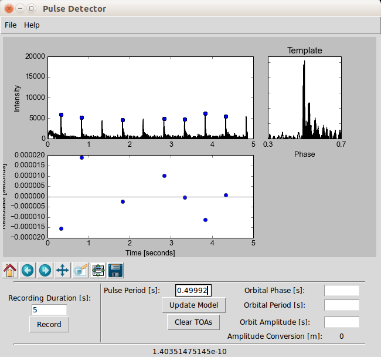

PulseDetector
=============

Audio Pulse Detector Demo for Pulsar Timing

Type in a duration to record. Note that if it is too long, you will run into buffer issues in displaying (fix to come shortly). ~5-10 seconds should be good. Times-of-arrival (TOAs) are fit by clicking left of a peak and then right of it and the program will find the maximum of the intensity. Currently, a pulse period can be fit, along with an orbit. For the orbit, green points are the original residuals, red curve is the contribution due to the orbit, and blue points are the resultant fit.

A chi-squared-like value is displayed on the bottom once you start a fit. Minimizing this improves the fit but does not take into account the number of parameters.

